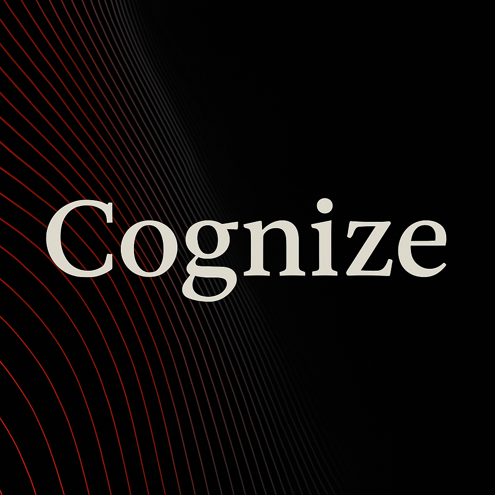

<p align="center">
  
</p>

# Cognize


---

**Cognize** is a symbolic cognition layer that gives any Python system — from LLMs to agents to simulations — a programmable epistemic lens.

It tracks projected belief, received signals, memory drift, rupture thresholds, and symbolic rupture, enabling cognition-aware control flows.

---

## What It Enables

- Detect and respond to hallucinations in LLMs  
- Add epistemic memory and rupture tracking to agents  
- Log symbolic pressure in belief vs reality systems  
- Filter outputs using symbolic rupture triggers  
- Enable cognition-awareness in RAG pipelines

---

## Core Concepts

| Symbol | Meaning                |
|--------|------------------------|
| `V`    | Projection (belief)    |
| `R`    | Reality (signal)       |
| `∆`    | Distortion             |
| `Θ`    | Tolerance threshold    |
| `E`    | Misalignment memory    |
| `⊙`    | Stable                 |
| `⚠`    | Rupture                |
| `∅`    | No signal yet          |

---

## Usage

```python
from cognize import EpistemicState

e = EpistemicState(V0=0.0, threshold=0.4)

# Pass signals over time
for R in [0.1, 0.3, 0.6, 0.8]:
    e.receive(R)
    print(e.symbol(), e.state())
